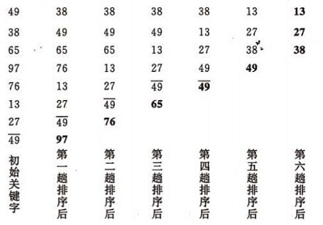
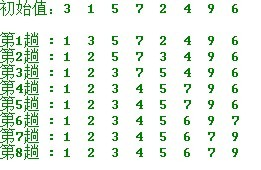

####  QuickSort - 快速升序排序

快速排序是通常被认为在同数量级（O(nlog2n)）的排序方法中平均性能最好的。但若初始序列按关键码有序或基本有序时，快排序反而蜕化为冒泡排序。为改进之，通常以“三者取中法”来选取基准记录，即将排序区间的两个端点与中点三个记录关键码居中的调整为支点记录。快速排序是一个不稳定的排序方法

1. 先调用改进算法QsortImprove使之基本有序
2. 再用插入排序对基本有序序列排序
  
        + (void)quickSort:(NSMutableArray *)array arrayCount:(int)c centerK:(int)k{
        [self qsortImprove:array lowA:0 highB:c centerK:k];
        for (int i = 1; i <= c; i ++) {
        int tmp = (int)[array[i] integerValue];
        int j = i - 1;
        while (tmp < (int)[array[j] integerValue]) {
            array[j + 1] = array[j];
            j = j - 1;
        }
        array[j + 1] = [NSNumber numberWithInt:tmp];
           }
        }

3. 长度大于k时开始递归，k为指定的数
4. 调用的PartitionArray 算法保持不变

        +(void)qsortImprove:(NSMutableArray *)array lowA:(int)a highB:(int)b centerK:(int)k{
        if (b - a > k) {
        int privot = [self partitionArray:array lowA:a highB:b];
        [self qsortImprove:array lowA:a highB:privot -1 centerK:k];
        [self qsortImprove:array lowA:privot +1 highB:b centerK:k];
          }
        }

5. 基本有序
 
        + (int)partitionArray:(NSMutableArray *)array lowA:(int)a highB:(int)b{
        //    基准元素
         int privotKey = (int)array[a];
        //     从表的两端交替地向中间扫描
        while (a < b) {
        
        while (a < b && [array[b] integerValue] >= privotKey) {
            b--;
            int tmp = (int)[array[a] integerValue];
            array[a] = array[b];
            array[b] = [NSNumber numberWithInt:tmp];
        }
        while (a < b && [array[a] integerValue] <= privotKey) {
            a++;
            int tmp = (int)[array[a] integerValue];
            array[a] = array[b];
            array[b] = [NSNumber numberWithInt:tmp];
            }
          }
         return a;
        }

#### BubbleSort - 冒泡排序

对冒泡排序常见的改进方法是加入一标志性变量exchange，用于标志某一趟排序过程中是否有数据交换，如果进行某一趟排序时并没有进行数据交换，则说明数据已经按要求排列好，可立即结束排序，避免不必要的比较过程。
传统冒泡排序中每一趟排序操作只能找到一个最大值或最小值,我考虑利用在每趟排序中进行正向和反向两遍冒泡的方法一次可以得到两个最终值(最大者和最小者) , 从而使排序趟数几乎减少了一半。

    +(void)bubbleSort:(NSMutableArray *)array lowA:(int)low highB:(int)high{
    int tmp,j;
    while (low < high) {
        for (j= low; j < high; ++j) //正向冒泡,找到最大者
            if ([array[j] integerValue]> [array[j+1] integerValue]) {
                tmp = (int)[array[j] integerValue];
                array[j]=array[j+1];
                array[j+1]=[NSNumber numberWithInt:tmp];
            }
        --high;                 //修改high值, 前移一位
        for ( j= high; j > low; --j) //反向冒泡,找到最小者
            if ([array[j] integerValue]<[array[j-1] integerValue]) {
                tmp = (int)[array[j] integerValue];
                array[j]=array[j-1];
                array[j-1]=[NSNumber numberWithInt:tmp];
            }
        ++low;//修改low值,后移一位
      }
    }

#### SelectSort - 简单选择排序

1. 在要排序的一组数中，选出最小（或者最大）的一个数与第1个位置的数交换；

2. 然后在剩下的数当中再找最小（或者最大）的与第2个位置的数交换，依次类推，直到第n-1个元素（倒数第二个数）和第n个元素（最后一个数）比较为止。

    + (void)selectSort:(NSMutableArray *)array arrayCount:(int)n{
    for (int i = 0; i < n; i ++) {
        for (int j = i + 1; j < n; j ++) {
            if ([array[i] integerValue] > [array[j] integerValue]) {
                int temp = [array[i] intValue];
                array[i] = array[j];
                array[j] = [NSNumber numberWithInt:temp];
            }
        }
     }
    }
    
#### ComparatorSort - 比较排序

利用系统自带的方法比较排序

    +(NSArray *)ComparatorSort:(NSMutableArray *)array{

    NSArray * arr = [array sortedArrayUsingComparator:^NSComparisonResult(id obj1, id obj2)
    {
        if ([obj1 integerValue] > [obj2 integerValue]) {
            return (NSComparisonResult)NSOrderedDescending;
        }
        if ([obj1 integerValue] < [obj2 integerValue]) {
            return (NSComparisonResult)NSOrderedAscending;
        }
        return (NSComparisonResult)NSOrderedSame;
    }];
    return arr;
    }

